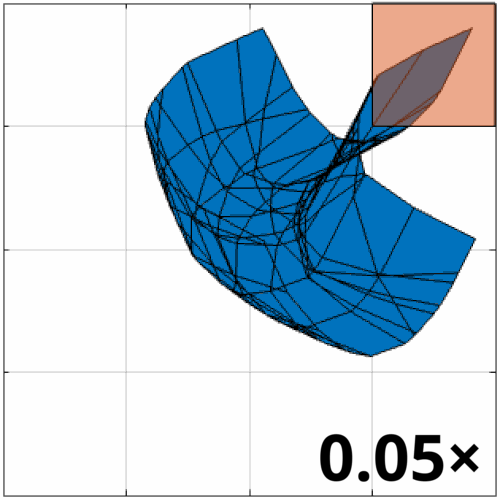
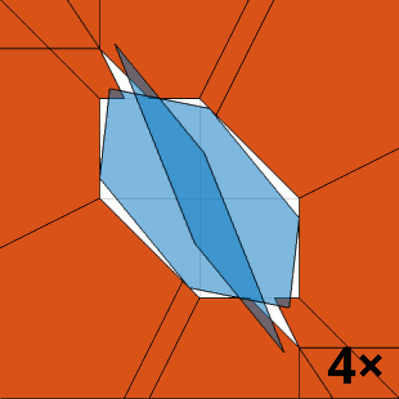
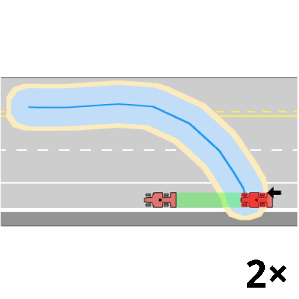

# Provably-Safe Neural Network Training Using Hybrid Zonotope Reachability Analysis

The technique implemented in this repository allows the user to train fully-connected ReLU neural networks with non-convex constraints.

Specifically, given a non-convex input set and a non-convex unsafe set, this method extracts learning signal to push the <strong style="color: #0072BD">output set</strong> (*image of the input set for the neural network*) out of collision with the <strong style="color: #D95319">unsafe set</strong>, which enables:
1. Synthesis of forward-invariant controllers; 
2. Reach-avoid for black-box dynamical systems.

<p align="center">
    
    
    
</p>

-------
[**[Website]**](https://saferoboticslab.me.gatech.edu/research/hybrid-zonotope-training/) &ensp; [**[Paper]**](https://doi.org/10.1109/CDC57313.2025.11312423)

-------
**Authors:** Long Kiu Chung, Shreyas Kousik

-------
## Updates
- [2025/05/01] **v0.1.0**: Initial code release

-------
## Setup Requirements
### Installation
1. Create and activate a Conda environment from `environment.yml` by following [this tutorial](https://docs.conda.io/projects/conda/en/latest/user-guide/tasks/manage-environments.html#creating-an-environment-from-an-environment-yml-file).
2. Install PyTorch by following [this guide](https://pytorch.org/).

-------
## Navigating This Repo
1. To run the examples from the paper, simply run `python main_<example>.py` in the terminal, where `<example>` is either `toy`, `doubleint`, or `drift`.
2. The main scripts use the neural networks stored in `data/network`, which were trained by running `python pretrain_<example>.py` in the terminal.
3. To change the neural network's size in `toy`, comment out the desired `network_size` in `main` of `main_toy.py` or `pretrain_toy.py`.

-------
## Todo
Visualization and some hybrid zonotope operations have not yet been implemented. As an alternative, consider exporting the hybrid zonotopes to [zonoLAB](https://github.com/ESCL-at-UTD/zonoLAB) using `saveToMATLAB`.

-------
## Citation
Please cite [this paper](https://arxiv.org/abs/2501.13023) if you use our method in your work:
```bibtex
@inproceedings{chung2025provably,
  title={Provably-safe neural network training using hybrid zonotope reachability analysis},
  author={Chung, Long Kiu and Kousik, Shreyas},
  booktitle={2025 IEEE 64th Conference on Decision and Control (CDC)},
  pages={7030--7037},
  year={2025},
  organization={IEEE}
}
```
